# MakeDoc Backend Documentation

## Overview

The MakeDoc backend is a Backstage backend plugin that starts and monitors Kubernetes Jobs responsible for generating and publishing documentation.

The backend has four main responsibilities:

1. Validate execution requests.
2. Create and run a Kubernetes Job.
3. Track Job status and stream status/log updates.
4. Expose the generated documentation through the repository updated by the Job.

The Kubernetes Job itself runs three stages:

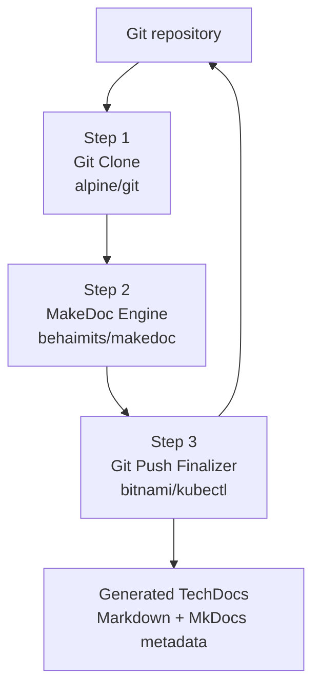

The backend communicates with Kubernetes through the Kubernetes API.

---

# Backend Structure

The important backend files are:

```text
backend/
├── router.ts
├── job-service.ts
├── job-status.ts
├── job-monitor.ts
├── job-events.ts
├── job-logs.ts
├── kubernetes.ts
├── validation.ts
├── types.ts
└── templates/
    └── job-template.ts
```

### File responsibilities

| File | Responsibility |
|---|---|
| `router.ts` | HTTP API endpoints |
| `job-service.ts` | Creates and starts MakeDoc Jobs |
| `job-template.ts` | Builds the Kubernetes Job manifest |
| `job-status.ts` | Reads Kubernetes Pods and determines Job status |
| `job-monitor.ts` | Periodically checks the active Job |
| `job-events.ts` | Stores and publishes Job status updates |
| `job-logs.ts` | Collects and streams MakeDoc logs |
| `kubernetes.ts` | Creates Kubernetes API clients |
| `validation.ts` | Validates incoming execution requests |
| `types.ts` | Shared TypeScript types |

---

# GitHub Personal Access Token Permissions

MakeDoc requires a GitHub Personal Access Token when it needs to clone a private repository and push the generated documentation back into that repository.

The exact permissions depend on whether the token is a classic PAT or a fine-grained PAT. For the recommended fine-grained GitHub Personal Access Token, the repository permissions should include the following.

## Required repository permissions

| Permission          | Access             | Purpose                                                                                                      |
| ------------------- | ------------------ | ------------------------------------------------------------------------------------------------------------ |
| **Contents**        | **Read and write** | Allows MakeDoc to clone/read repository contents and commit/push generated documentation                     |
| **Metadata**        | **Read-only**      | Required by GitHub for repository access and automatically included with fine-grained repository permissions |
| **Commit statuses** | **Read-only**      | Required when the Backstage/TechDocs integration needs to read GitHub commit status information              |

The token should be restricted to only the repositories that MakeDoc actually needs to access.

Do not use a token with broader repository permissions than necessary.

---

# Kubernetes Architecture

The backend uses two Kubernetes ServiceAccounts.
## Controller ServiceAccount

`makedoc-controller` is used by the Backstage backend.

It can:

- create Jobs
- read/list/watch Jobs
- delete Jobs
- create/read/patch/delete Secrets
- read/list/watch Pods
- read Pod logs

## Runner ServiceAccount

`makedoc-runner` is used by the Kubernetes Job itself.

It can:

- get Pods
- list Pods

This permission is required because the finalizer container checks the status of the MakeDoc container before continuing.

---

# Kubernetes Installation

The backend requires the following Kubernetes resources.

```yaml
apiVersion: v1
kind: ServiceAccount
metadata:
  name: makedoc-controller
  namespace: default

---
apiVersion: v1
kind: ServiceAccount
metadata:
  name: makedoc-runner
  namespace: default

---
apiVersion: rbac.authorization.k8s.io/v1
kind: Role
metadata:
  name: makedoc-controller-role
  namespace: default
rules:
  - apiGroups:
      - batch
    resources:
      - jobs
    verbs:
      - create
      - get
      - list
      - watch
      - delete

  - apiGroups:
      - ""
    resources:
      - secrets
    verbs:
      - create
      - get
      - patch
      - delete

  - apiGroups:
      - ""
    resources:
      - pods
      - pods/log
    verbs:
      - get
      - list
      - watch

---
apiVersion: rbac.authorization.k8s.io/v1
kind: RoleBinding
metadata:
  name: makedoc-controller-binding
  namespace: default
subjects:
  - kind: ServiceAccount
    name: makedoc-controller
    namespace: default
roleRef:
  kind: Role
  name: makedoc-controller-role
  apiGroup: rbac.authorization.k8s.io

---
apiVersion: rbac.authorization.k8s.io/v1
kind: Role
metadata:
  name: makedoc-runner-role
  namespace: default
rules:
  - apiGroups:
      - ""
    resources:
      - pods
    verbs:
      - get
      - list

---
apiVersion: rbac.authorization.k8s.io/v1
kind: RoleBinding
metadata:
  name: makedoc-runner-binding
  namespace: default
subjects:
  - kind: ServiceAccount
    name: makedoc-runner
    namespace: default
roleRef:
  kind: Role
  name: makedoc-runner-role
  apiGroup: rbac.authorization.k8s.io
```

Apply it with:

```bash
kubectl apply -f makedoc-rbac.yaml
```

---

# Generating the Kubernetes Kubeconfig

The installation script creates a dedicated kubeconfig for the controller account.

```bash
chmod +x install-makedoc.sh

./install-makedoc.sh
```


```bash
#!/usr/bin/env bash

set -euo pipefail


CONTEXT="${1:-$(kubectl config current-context)}"

NAMESPACE="default"

SERVICE_ACCOUNT="makedoc-controller"

OUTPUT="makedoc-controller-kubeconfig.yaml"


echo "================================="
echo "Installing MakeDoc Kubernetes RBAC"
echo "================================="
echo ""

echo "Using context:"
echo "${CONTEXT}"
echo ""


echo "Applying RBAC..."

kubectl apply -f makedoc-rbac.yaml


echo ""
echo "Creating controller token..."

TOKEN=$(kubectl create token \
  "${SERVICE_ACCOUNT}" \
  -n "${NAMESPACE}" \
  --duration=8760h)


echo "Reading cluster information..."

SERVER=$(kubectl config view \
  --raw \
  --context "${CONTEXT}" \
  -o jsonpath='{.clusters[0].cluster.server}')


CA_DATA=$(kubectl config view \
  --raw \
  --context "${CONTEXT}" \
  -o jsonpath='{.clusters[0].cluster.certificate-authority-data}')


if [ -z "${CA_DATA}" ]; then

  CA_PATH=$(kubectl config view \
    --raw \
    --context "${CONTEXT}" \
    -o jsonpath='{.clusters[0].cluster.certificate-authority}')


  if [ -z "${CA_PATH}" ]; then
    echo ""
    echo "ERROR: Could not find Kubernetes CA certificate"
    exit 1
  fi


  CA_DATA=$(cat "${CA_PATH}" | base64 -w 0)

fi


echo ""
echo "Generating kubeconfig..."


cat > "${OUTPUT}" <<EOF
apiVersion: v1
kind: Config

clusters:

- name: makedoc-cluster
  cluster:
    server: ${SERVER}
    certificate-authority-data: ${CA_DATA}


contexts:

- name: makedoc-controller
  context:
    cluster: makedoc-cluster
    user: makedoc-controller


current-context: makedoc-controller


users:

- name: makedoc-controller
  user:
    token: ${TOKEN}
EOF


chmod 600 "${OUTPUT}"


echo ""
echo "================================="
echo "MakeDoc installation complete"
echo "================================="
echo ""

echo "Generated kubeconfig:"
echo "${OUTPUT}"
```
The generated kubeconfig allows the Backstage backend to authenticate to Kubernetes using the `makedoc-controller` ServiceAccount.

The generated file is then configured through:

```bash
export MAKEDOC_KUBECONFIG=/path/to/makedoc-controller-kubeconfig.yaml
```

For a persistent shell configuration:

```bash
echo 'export MAKEDOC_KUBECONFIG=/path/to/makedoc-controller-kubeconfig.yaml' >> ~/.bashrc

source ~/.bashrc
```

The kubeconfig contains a token created for:

```text
makedoc-controller
```

Protect the generated kubeconfig because it provides access to the Kubernetes permissions assigned to that ServiceAccount.

---

# `kubernetes.ts`

This file is the Kubernetes API connection layer.

It creates and caches:

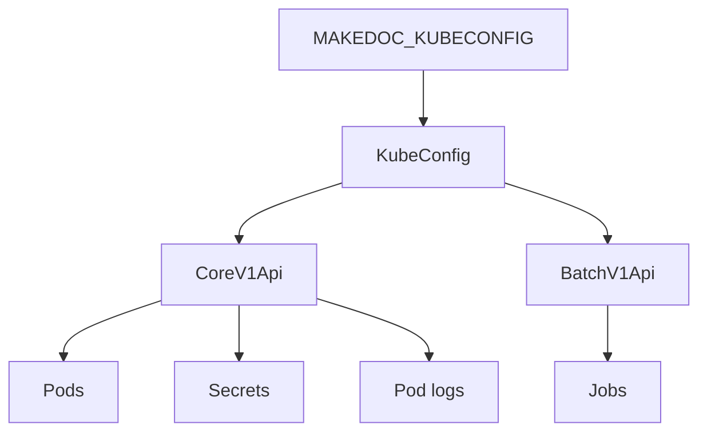

## `getKubeConfig()`

Loads the kubeconfig specified by:

```text
MAKEDOC_KUBECONFIG
```

The configuration is cached after the first call.

If the environment variable is missing, the function throws an error.

## `getCoreApi()`

Creates and caches a Kubernetes `CoreV1Api` client.

Used for:

- Pods
- Pod logs
- Secrets

## `getBatchApi()`

Creates and caches a Kubernetes `BatchV1Api` client.

Used for:

- Jobs

## `KUBE_NAMESPACE`

The backend currently operates in:

```text
default
```

If the namespace changes, this constant and the Kubernetes RBAC configuration need to remain consistent.

---

# `validation.ts`

This file validates the request before anything is created in Kubernetes.

## `validateRequest()`

Validates:

- `repoUrl`
- `accessToken`
- `inputDir`
- `outputDir`
- `workspace`
- `profile`
- `filter`
- `selections`

Validation happens before Kubernetes resources are created.

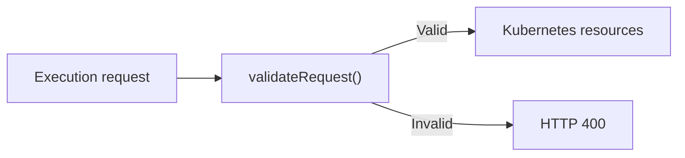

---

# `types.ts`

This file contains the shared data structures.

## `JobStatus`

Possible statuses are:

```text
STARTED
CLONING_REPOSITORY
MAKEDOC_RUNNING
COMMITTING_DOCUMENTATION
COMPLETED
FAILED
```

The status model represents the logical execution pipeline:

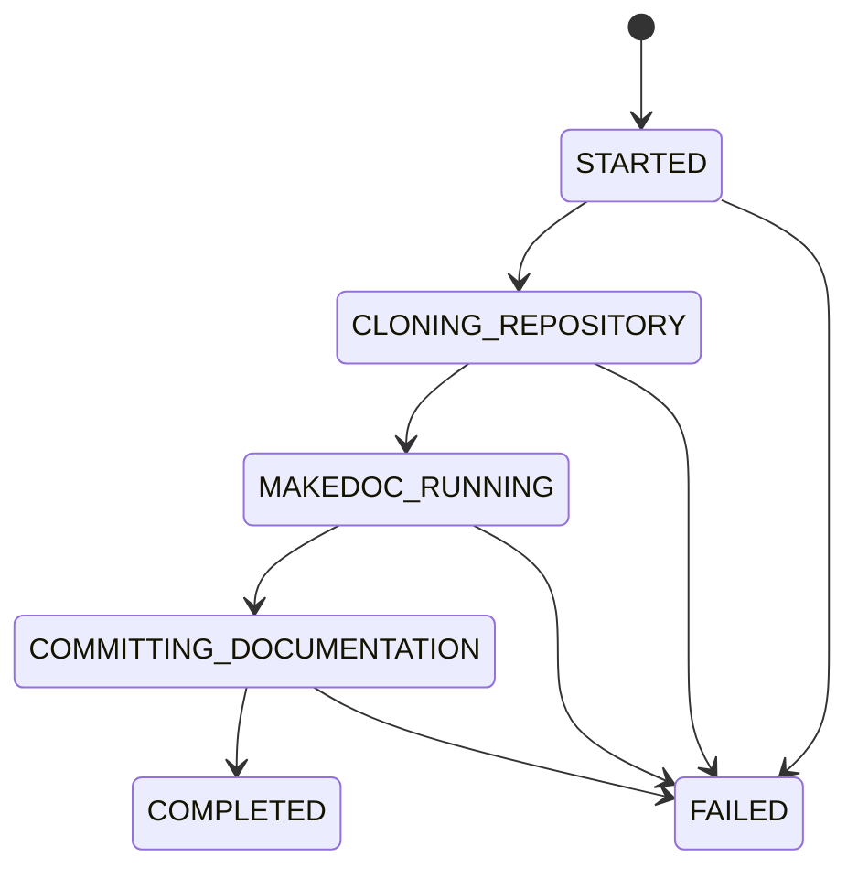

## `RunJobRequest`

Represents the frontend request used to start a MakeDoc execution.

Main fields:

```text
repoUrl
accessToken
inputDir
outputDir
workspace
profile
filter
selections
```

## `JobStatusResponse`

Contains:

```text
status
podName?
```

The Pod name is optional because the status calculation does not always require it.

---

# `job-service.ts`

This is the main execution service.

## `generateJobName()`

Creates a unique Job name:

```text
makedoc-job-<random-id>
```

The random identifier is generated using Node's `crypto` module.

---

## `buildContainerEnv()`

Converts frontend MakeDoc options into Kubernetes environment variables.

For example:

```text
workspace
profile
filter
bw5
bw6
ems
```

become environment variables consumed by:

```text
step2-makedoc-engine
```

Product formats are converted into semicolon-separated values.

For example:

```text
bw5:
  html: true
  pdf: true
```

becomes:

```text
bw5=html;pdf
```


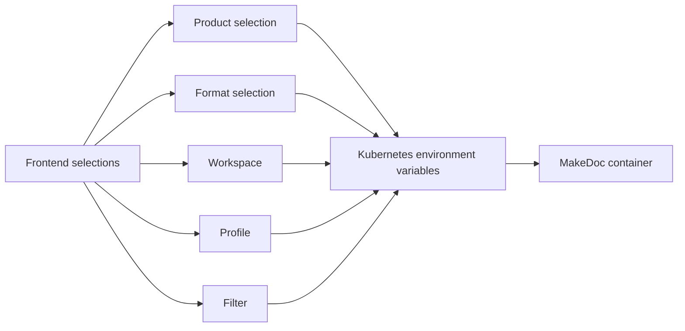

---

## `runJob()`

`runJob()` coordinates the complete execution.

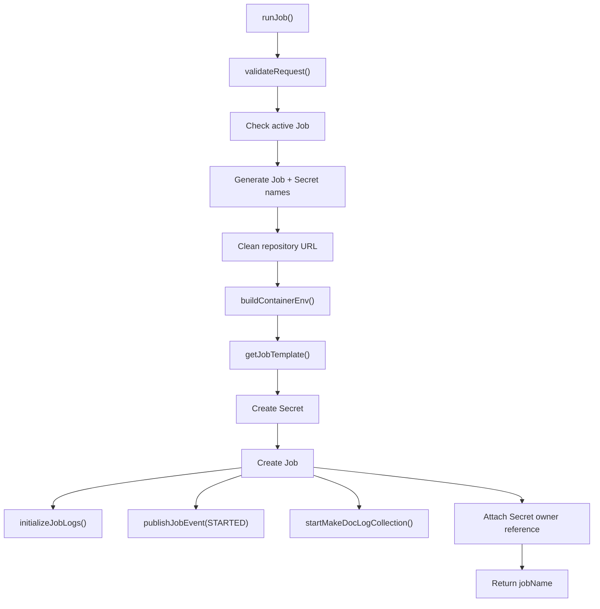

### Secret handling

The Git token is stored in a temporary Kubernetes Secret:

```text
<job-name>-git-token
```

The Job references it through:

```text
GIT_TOKEN
```

After the Job is created, the Secret receives an owner reference pointing to the Job.

This allows Kubernetes to clean up the Secret with the Job.

---

# `job-template.ts`

This file defines the Kubernetes Job itself.

## `getJobTemplate()`

Creates the complete `V1Job` manifest.

The template receives:

```text
jobName
namespace
repoUrl
inputDir
outputDir
secretName
workspace
makedocEnv
```

The `makedocEnv` argument contains the request-specific environment variables created by `buildContainerEnv()`.

This keeps Job construction separate from request processing.

---

# Kubernetes Job Lifecycle

The three containers cooperate through a shared `emptyDir` volume.

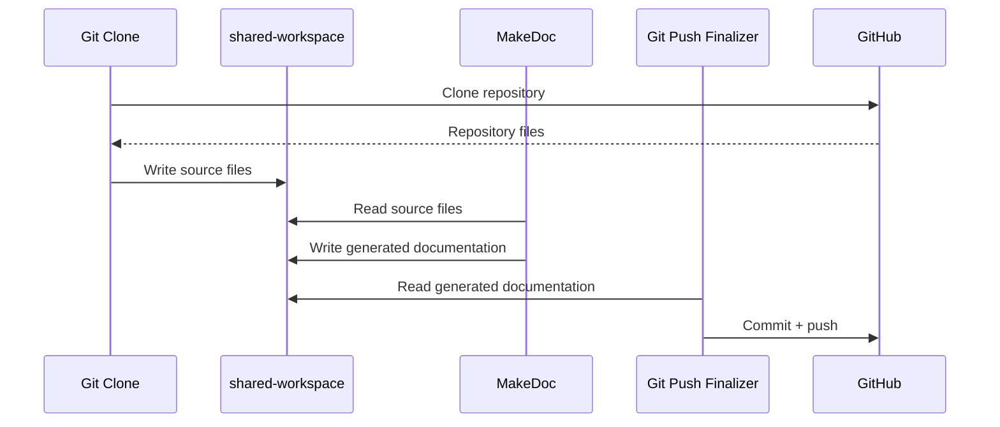

The volume exists only for the lifetime of the Pod:

```text
Job
 |
 +-- step1-git-clone
 |
 +-- step2-makedoc-engine
 |
 +-- step3-git-push-finalizer
 |
 +-- shared-workspace
        |
        +-- source files
        +-- MakeDoc output
        +-- generated TechDocs
```

---

# Step 1 — Git Clone

Container:

```text
step1-git-clone
```

Image:

```text
alpine/git:latest
```

The container:

1. Reads the Git token from the Kubernetes Secret.
2. Clones the repository.
3. Creates shared workspace directories.
4. Copies the requested input directory.
5. Copies the requested workspace when configured.
6. Makes the shared directory writable.
7. Unsets the Git token.

The shared volume is:

```text
shared-workspace
```

It is backed by:

```text
emptyDir
```

---
# Step 2 — MakeDoc Engine

Container:

```text
step2-makedoc-engine
```

Image:

```text
behaimits/makedoc:latest
```

This is where MakeDoc actually runs.

The container receives the request-specific environment variables generated by:

```text
buildContainerEnv()
```

It also mounts:

```text
/workspace/projects
/home/makedoc/server/storage/default
```

and, when configured:

```text
/home/makedoc/server/scripts/srv/<workspace>
```

The shared volume allows data from Step 1 to be consumed by Step 2 and later processed by Step 3.

---

# Step 3 — Git Push Finalizer

Container:

```text
step3-git-push-finalizer
```

Image:

```text
bitnami/kubectl:latest
```

The finalizer waits until the MakeDoc container has terminated.

It creates:

```text
index.md
mkdocs.yml
catalog-info.yaml
```

and processes the generated documentation.

---

# Generated TechDocs Structure

The finalizer searches for generated `md` directories and builds the MkDocs navigation.

The resulting repository contains approximately:

```text
repository/
├── index.md
├── mkdocs.yml
├── catalog-info.yaml
└── <output-directory>/
    └── <documentation-id>/
        └── md/
            ├── ...
            └── ...
```

The generated `mkdocs.yml` uses:

```yaml
plugins:
  - techdocs-core
```

The navigation is generated recursively from the Markdown directory structure.

The generated `catalog-info.yaml` contains:

```yaml
apiVersion: backstage.io/v1alpha1
kind: Component
metadata:
  name: <repository-name>
  description: MakeDoc generated documentation
  annotations:
    backstage.io/techdocs-ref: dir:.
spec:
  type: documentation
  lifecycle: production
  owner: user:default/guest
```

This allows Backstage TechDocs to identify the repository as a documentation component.

---
# `job-status.ts`

This file translates Kubernetes Pod state into the application's `JobStatus`.

## `calculateJobStatus()`

Checks the three pipeline containers:

```text
step1-git-clone
step2-makedoc-engine
step3-git-push-finalizer
```

Any failed stage can result in:

```text
FAILED
```

---

## `getJobStatus()`

Finds the Pod belonging to:

```text
job-name=<jobName>
```

and calculates its status.

If no Pod is found, it returns:

```text
STARTED
```

The response also contains the Pod name when available.

---

## `getActiveJob()`

Finds MakeDoc Pods and determines whether one is still active.

A Job is considered inactive when its calculated status is:

```text
COMPLETED
```

or:

```text
FAILED
```

The distinction between active and latest Job state is important:

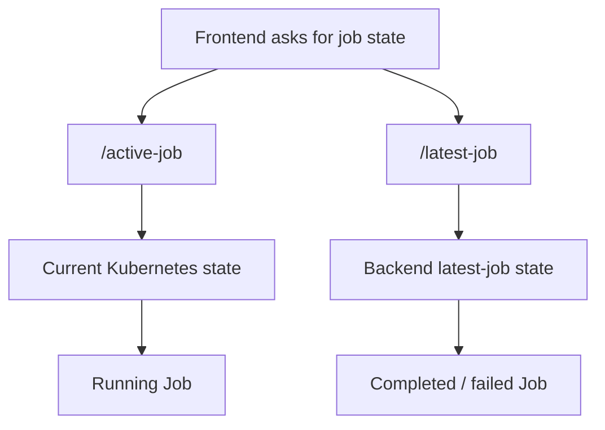

---

# `job-monitor.ts`

The monitor periodically checks the active Job.

The polling interval is:

```text
3000 ms
```

The monitor stores:

```text
lastJobName
lastStatus
```

so that unchanged statuses are not repeatedly published.

Completed and failed Jobs remain stored for one hour before the stored state is cleared.

---

# `job-events.ts`

This module manages status-update clients.

Its responsibilities are:

- maintain connected status clients
- publish Job status changes
- remember the latest Job
- send the latest status to newly connected clients

The data published to clients has the form:

```json
{
  "jobName": "makedoc-job-123",
  "status": "STARTED"
}
```

The event architecture is:

A newly connected client can receive the latest known state without waiting for another Kubernetes status transition.

---

# `job-logs.ts`

This module manages MakeDoc log collection.

Log collection is started immediately after the Job is created.

Previously collected logs can be replayed when a client connects.

The collector also prevents duplicate collectors for the same Job.

---

# `router.ts`

`router.ts` is the HTTP API layer.

It connects HTTP requests to the backend services.

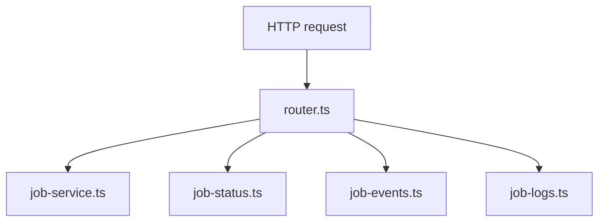

---

# `POST /run-job`

Starts a new MakeDoc Job.

Request:

```json
{
  "repoUrl": "...",
  "accessToken": "...",
  "inputDir": "...",
  "outputDir": "...",
  "workspace": "...",
  "profile": "...",
  "filter": "...",
  "selections": {}
}
```

Flow:

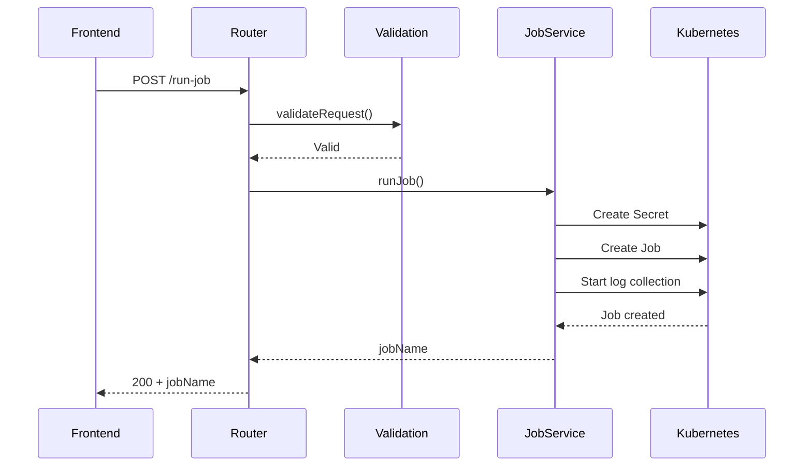

A validation error returns HTTP `400`.

Other execution errors return HTTP `500`.

---

# `GET /events`

Opens the Job status Server-Sent Events stream.

Response type:

```text
text/event-stream
```

The client remains connected and receives status changes.

Example:

```text
data: {"jobName":"makedoc-job-123","status":"STARTED"}

data: {"jobName":"makedoc-job-123","status":"CLONING_REPOSITORY"}

data: {"jobName":"makedoc-job-123","status":"MAKEDOC_RUNNING"}

data: {"jobName":"makedoc-job-123","status":"COMPLETED"}
```

The route registers the connection with `job-events.ts` and removes it when the client disconnects.

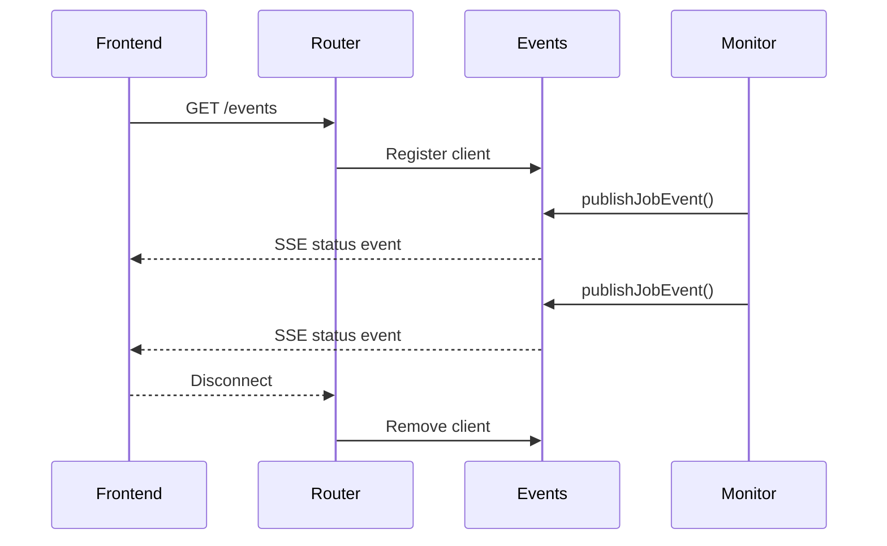

---

# `GET /latest-job`

Returns the most recently created MakeDoc Job.

Unlike `/active-job`, this endpoint can still return the previous Job after it has completed or failed.

This information comes from the backend's stored latest-job state rather than requiring an active Kubernetes Pod.

---

# `GET /active-job`

Returns information about the currently active MakeDoc Job.

This endpoint is mainly used to determine whether another execution can be started.

Possible result:

```json
{
  "active": true,
  "jobName": "makedoc-job-123",
  "status": "MAKEDOC_RUNNING"
}
```

When no active Job exists:

```json
{
  "active": false
}
```


---

# `GET /job-status/:jobName`

Returns the current Kubernetes-derived status for a specific Job.

Example:

```text
GET /job-status/makedoc-job-123
```

Response:

```json
{
  "status": "MAKEDOC_RUNNING",
  "podName": "makedoc-job-123-xxxxx"
}
```

This endpoint performs a direct status lookup rather than relying on a previously published event.

---

# `GET /job-logs/:jobName`

Opens the MakeDoc log stream for a specific Job.

```text
GET /job-logs/makedoc-job-123
```

The backend:

1. Opens an SSE response.
2. Sends an initial connection comment.
3. Replays already collected logs.
4. Registers the client for future logs.
5. Ensures log collection is running.

The connection uses:

```text
Content-Type: text/event-stream
```

---
# Status Flow

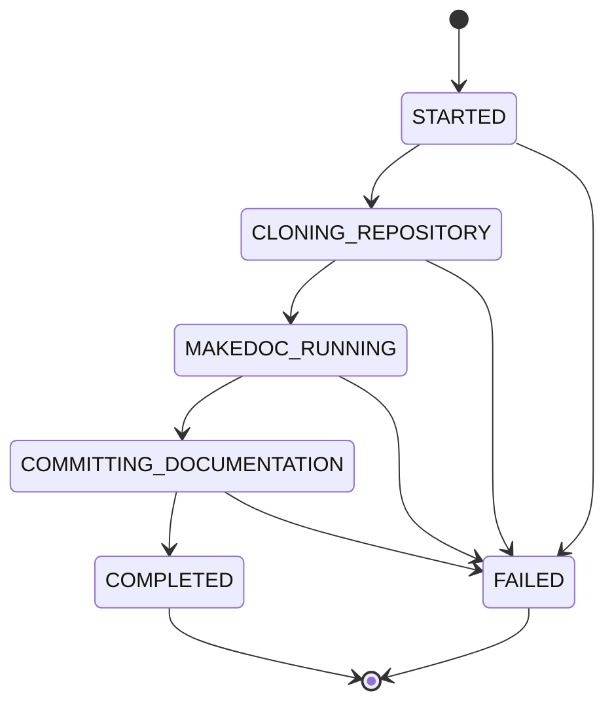


---

# Techdocs

The resulting repository can then be consumed by Backstage TechDocs:

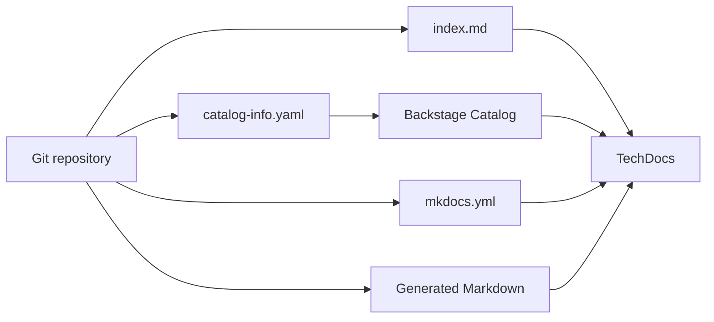

---

# Authentication Overview

There are two separate authentication mechanisms in the system.
### Backstage authentication

Frontend requests to authenticated backend endpoints use the Backstage identity token:

```text
Authorization: Bearer <Backstage identity token>
```

### GitHub authentication

The GitHub Personal Access Token is supplied as part of the MakeDoc execution request and is passed into the Kubernetes execution through a Secret.

These credentials have different purposes:

| Credential | Used for |
|---|---|
| Backstage identity token | Authenticating frontend-to-backend API requests |
| Kubernetes controller token | Authenticating backend-to-Kubernetes API requests |
| GitHub PAT | Authenticating MakeDoc against GitHub |

---

# Important Configuration

## Kubernetes namespace

Defined in:

```text
kubernetes.ts
```

Currently:

```text
default
```

The RBAC resources and generated Job must use the same namespace.

## Kubernetes credentials

Environment variable:

```text
MAKEDOC_KUBECONFIG
```

Example:

```bash
export MAKEDOC_KUBECONFIG=/path/to/makedoc-controller-kubeconfig.yaml
```

## Job ServiceAccount

Defined in:

```text
job-template.ts
```

Currently:

```text
makedoc-runner
```

This must exist in the target namespace.

## MakeDoc image

Defined in:

```text
job-template.ts
```

Currently:

```text
behaimits/makedoc:latest
```

## Git clone image

```text
alpine/git:latest
```

## Finalizer image

```text
bitnami/kubectl:latest
```


---

# Cleanup

Remove the Kubernetes resources:

```bash
kubectl delete -f makedoc-rbac.yaml
```

Remove the generated controller kubeconfig:

```bash
rm makedoc-controller-kubeconfig.yaml
```

If the GitHub Personal Access Token is no longer required, revoke it in GitHub rather than leaving an unused token active.
