# MakeDoc Frontend

## Overview

The MakeDoc frontend is a Backstage plugin that provides:

- a form for configuring a MakeDoc execution
- repository authentication
- MakeDoc workspace configuration
- TIBCO product and format selection
- live job status updates
- live Kubernetes/MakeDoc logs
- log download
- recovery of the latest job after page refresh

The frontend consists of three main components:

| File                | Responsibility                                            |
| ------------------- | --------------------------------------------------------- |
| `ExecutionForm.tsx` | Collects and submits MakeDoc execution parameters         |
| `JobStatus.tsx`     | Displays job progress and live logs                       |
| `MakeDocPage.tsx`   | Main page and controller between the form and status view |

The frontend communicates with the backend through:

- `POST /api/makedoc/run-job`
- `GET /api/makedoc/latest-job`
- `GET /api/makedoc/events`
- `GET /api/makedoc/job-logs/:jobName`

---

# Frontend Architecture

`MakeDocPage` is the top-level component.

It decides whether the user sees:

1. the execution form
2. the current job status
3. the latest job after a page refresh

---

# Component Relationship

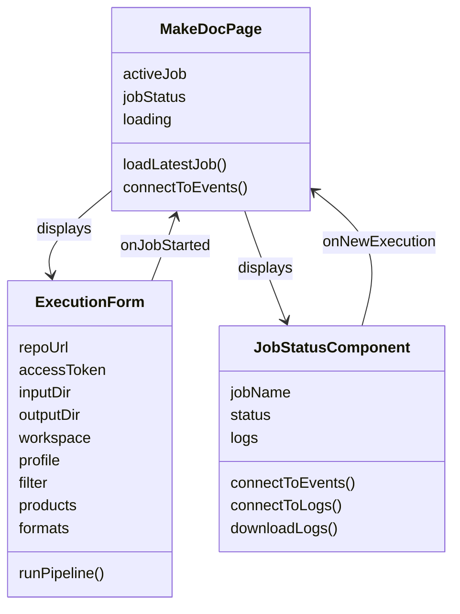

---

# MakeDocPage

## Purpose

`MakeDocPage.tsx` is the main page component.

It controls which frontend state is currently displayed and restores the latest MakeDoc execution when the page is refreshed.

## Main state

### `activeJob`

Stores the job currently displayed by the frontend.

```text
string | null
```

If it is `null`, the execution form is displayed.

If it contains a job name, `JobStatusComponent` is displayed.

### `jobStatus`

Stores the latest known status:

```text
STARTED
CLONING_REPOSITORY
MAKEDOC_RUNNING
COMMITTING_DOCUMENTATION
COMPLETED
FAILED
```

### `loading`

Controls the initial lookup of the latest job.

---

# MakeDocPage Startup Flow

When the page loads, two operations are started:

1. retrieve the latest MakeDoc job
2. connect to the live status SSE stream

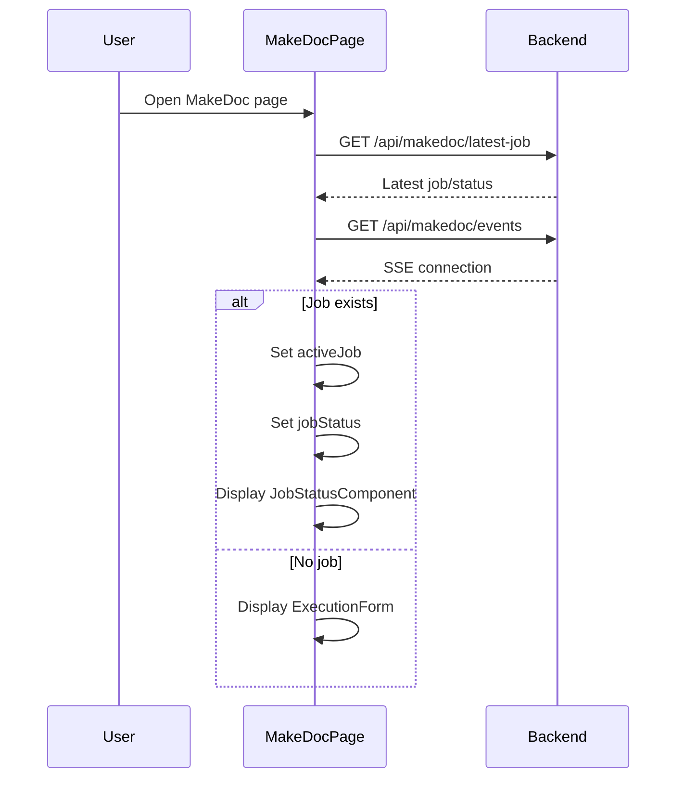

---

# `loadLatestJob()`

`loadLatestJob()` retrieves the latest MakeDoc execution from:

```text
GET /api/makedoc/latest-job
```

The response is expected to contain:

```text
{
    exists: boolean,
    jobName?: string,
    status?: JobStatus
}
```

If a job exists:

```text
activeJob = jobName
jobStatus = status
```

This allows the frontend to reconstruct the status page after a browser refresh.

The endpoint is intentionally different from `/active-job`.

An active Kubernetes Job can disappear after completion, while the backend keeps the latest MakeDoc execution information available.

---

# Live Job Status

`MakeDocPage` also connects to:

```text
GET /api/makedoc/events
```

This is an SSE stream.

The backend sends events containing the job name and status.

Example:

```text
data: {"jobName":"makedoc-job-a1b2c3d4e5f6","status":"MAKEDOC_RUNNING"}
```

The frontend only changes the displayed status when the event belongs to the currently displayed job.

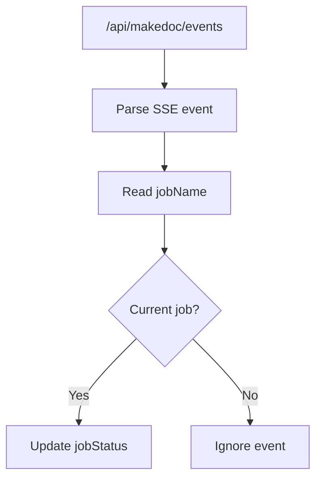

---

# `MakeDocPage` Display Logic

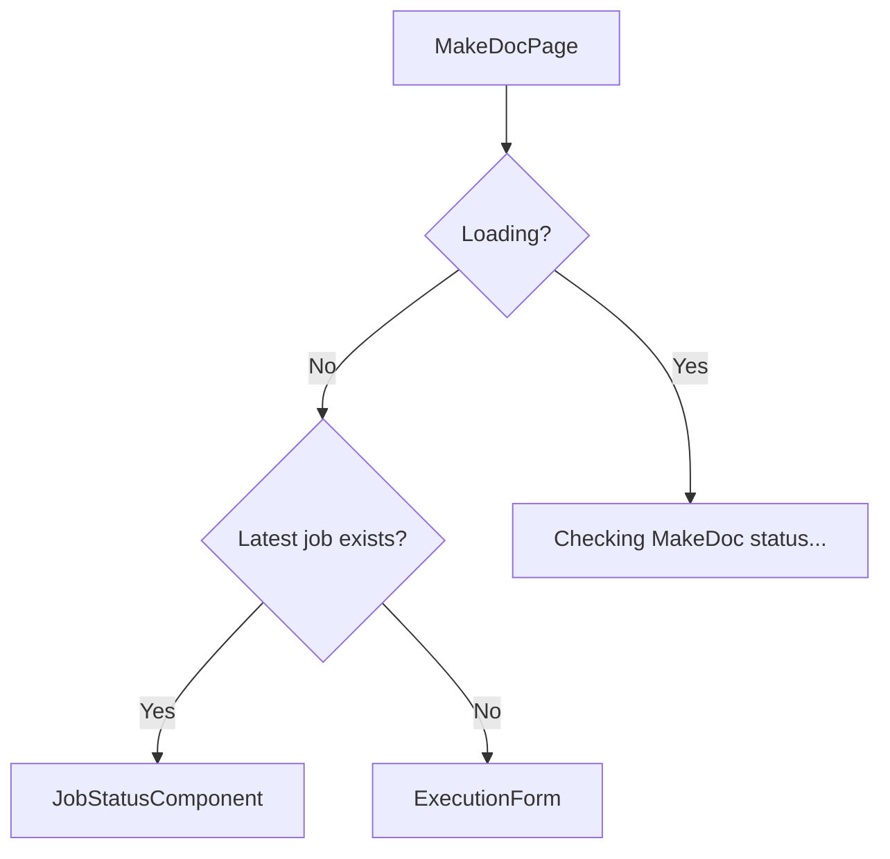

---

# Starting a New Execution

When the user finishes a job, the status component displays:

```text
Start new job
```

Clicking it does not delete the previous backend job.

It only resets the frontend view:

```text
activeJob = null
jobStatus = STARTED
```

The execution form is then displayed.

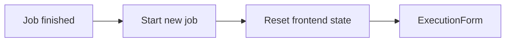

---

# ExecutionForm

## Purpose

`ExecutionForm.tsx` collects all parameters required for a MakeDoc execution.

The form contains four main configuration groups:

### Repository

- Repository URL
- Git access token
- Input directory
- Output directory

### MakeDoc configuration

- Workspace
- Profile
- Filter

### Products

- BW5
- BW6
- EMS

### Formats

- HTML
- PDF
- Markdown
- DOCX

---
# Local Storage

The form stores configuration in browser `localStorage`.

The storage key is:

```text
makedoc-execution-form
```

The saved state contains:

```text
repoUrl
inputDir
outputDir
workspace
profile
filter
products
formats
```

It does not contain:

```text
accessToken
```

---

# Loading Saved Form Data

On component mount:

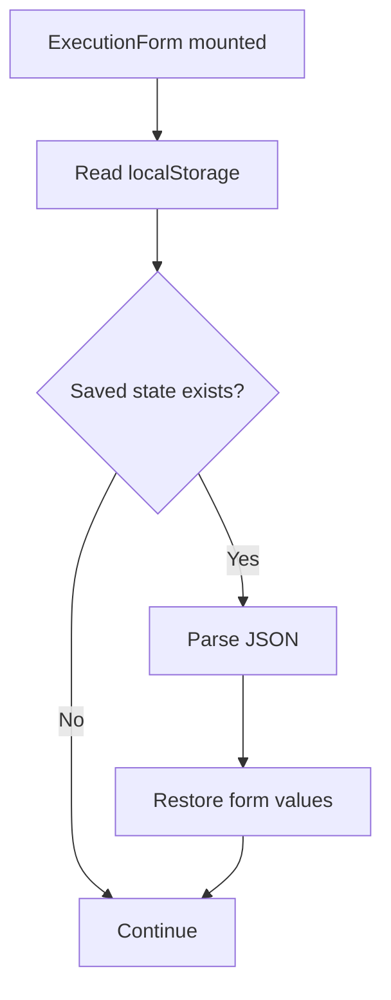

Invalid stored JSON is caught and logged instead of breaking the form.

---

# Saving Form Data

Whenever the relevant form state changes, the component writes the current configuration to local storage.

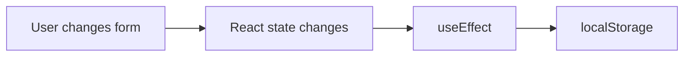

This means a user can leave the page and return later without losing most configuration.

---

# Product Selection

Products are represented by:

```text
bw5
bw6
ems
```

Each product can be enabled independently.

When a product is enabled, its format selectors are displayed.

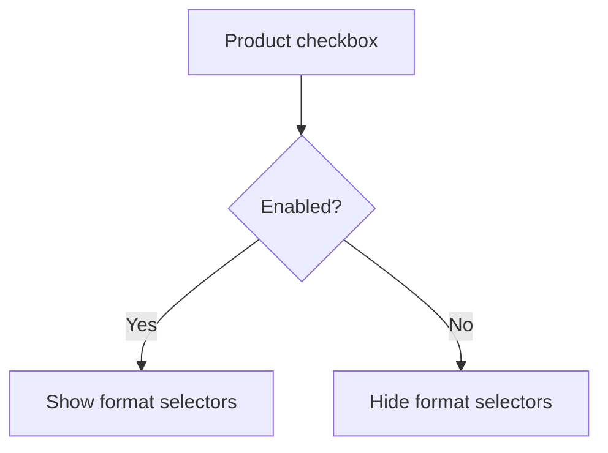

---

# Format Selection

Each product has four possible formats:

```text
HTML
PDF
MD
DOCX
```

The selected values are stored separately for each product.

For example:

```text
bw5:
    html: true
    pdf: false
    md: true
    docx: false
```

---

# `handleProductChange()`

`handleProductChange()` updates the enabled/disabled state of a product.

Conceptually:

```text
checkbox
    ↓
event.target.checked
    ↓
products[product]
```

It does not modify the format selections.

Therefore disabling a product hides its formats without destroying their selected state.

---

# `handleFormatChange()`

`handleFormatChange()` updates a single format for a single product.

Conceptually:

```text
BW5 → PDF
    ↓
checkbox changed
    ↓
formats.bw5.pdf
```

The previous product and format state is preserved.

---

# `renderFormatSelectors()`

`renderFormatSelectors()` generates the format selector UI for one product.

It uses a Material UI `Collapse`.

The format controls are therefore only visible when:

```text
products[product] === true
```

---

# `runPipeline()`

`runPipeline()` is the main submission function.

It performs the following steps:

1. reads the configured backend URL
2. creates the request payload
3. sends a POST request
4. parses the response
5. passes the returned job name to `MakeDocPage`
6. displays an error if the request fails

---

# Execution Request Flow

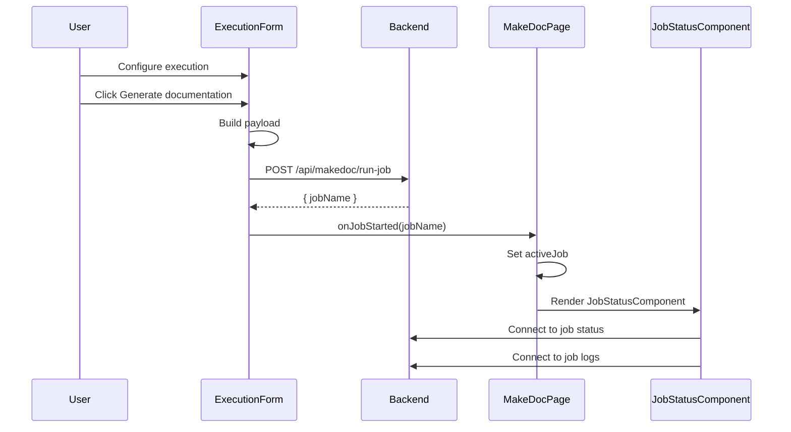

---

# Execution Payload

The frontend sends:

```text
{
    repoUrl,
    accessToken,
    inputDir,
    outputDir,
    workspace,
    profile,
    filter,
    selections
}
```

The product selections are converted into:

```text
selections: {
    bw5: products.bw5 ? formats.bw5 : null,
    bw6: products.bw6 ? formats.bw6 : null,
    ems: products.ems ? formats.ems : null
}
```

This means disabled products are explicitly sent as `null`.

---

# Frontend-to-Backend Execution Flow

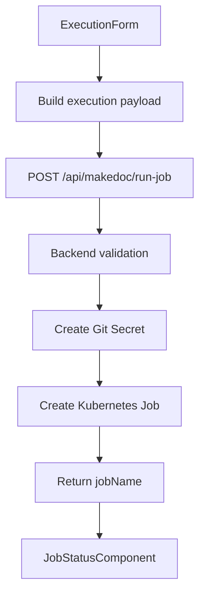

---

# Authentication

The frontend uses Backstage's identity API.

For authenticated SSE requests:

```text
identityApi.getCredentials()
```

retrieves the Backstage identity token.

The token is then sent as:

```text
Authorization: Bearer <token>
```

This is used for:

```text
/api/makedoc/latest-job
/api/makedoc/events
/api/makedoc/job-logs/:jobName
```

The execution request itself uses the Git access token inside the JSON payload because that token is required by the MakeDoc backend to access the requested repository.

---

# JobStatusComponent

## Purpose

`JobStatusComponent.tsx` displays the state of an individual MakeDoc execution.

It provides:

- current status
- progress stepper
- live logs
- automatic log scrolling
- log download
- completion/failure information
- start-new-job button

---
# Progress Stepper

The component defines five visible steps:

| Status | Label |
|---|---|
| `STARTED` | Starting job |
| `CLONING_REPOSITORY` | Cloning repository |
| `MAKEDOC_RUNNING` | Generating documentation |
| `COMMITTING_DOCUMENTATION` | Committing documentation |
| `COMPLETED` | Finished |

`FAILED` is not represented as a normal step.

When the status is `FAILED`, the stepper stops showing a normal active step.

---
# Job Status SSE

`JobStatusComponent` independently connects to:

```text
GET /api/makedoc/events
```

This is the general MakeDoc status stream.

The component parses SSE messages and ignores events belonging to other jobs.

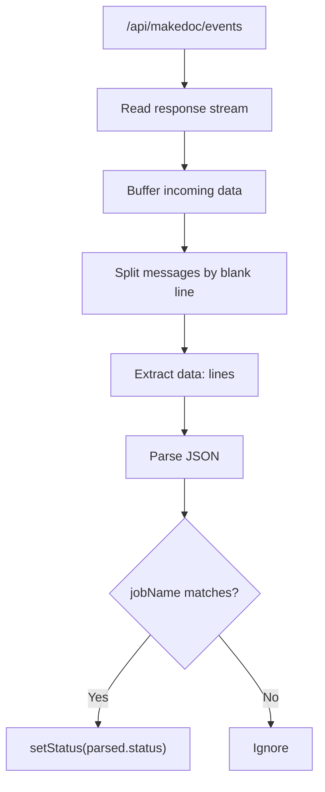

---

# Why the Status Stream Is Separate From Logs

The application separates:

```text
Job status
```

from:

```text
Job logs
```

The status stream tells the UI which execution stage is active.

The log stream provides detailed execution output.

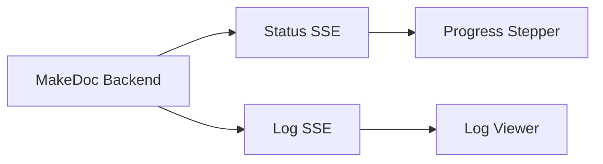

This separation keeps status handling independent from potentially large log output.

---

# Log Streaming

The frontend connects to:

```text
GET /api/makedoc/job-logs/:jobName
```

The backend owns the Kubernetes log collection.

The frontend does not directly read Kubernetes logs.

This is important because the frontend can connect after the job has already started or even after the Kubernetes pod has disappeared, as long as the backend still has the collected logs.

---

# Log Recovery After Refresh

The frontend does not store logs in `localStorage`.

Instead:

```text
Browser refresh
    ↓
MakeDocPage loads latest job
    ↓
JobStatusComponent mounts
    ↓
GET /job-logs/:jobName
    ↓
Backend sends stored logs
    ↓
Frontend rebuilds log display
```

---
# Log State

Logs are stored in:

```text
const [logs, setLogs] = useState<string[]>([])
```

Every received log event is appended:

```text
previous + parsed
```

The backend is responsible for sending historical logs first and new logs afterwards.

The frontend therefore does not need separate logic for:

- old logs
- new logs

Every received log event can simply be appended.

---
# Log Download

`downloadLogs()` creates a browser-generated text file.

The process is:

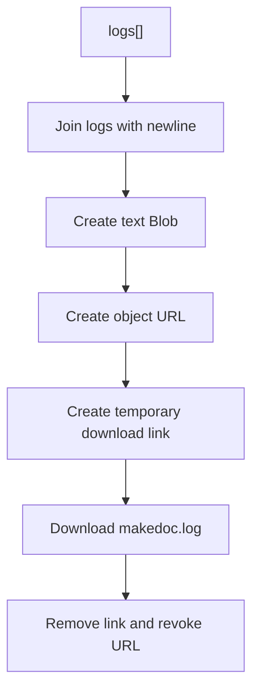

The download is entirely client-side.

No additional backend endpoint is required.

---

# Completion Logic

The component considers the job finished when:

```text
status === COMPLETED
```

or:

```text
status === FAILED
```

For a successful execution:

```text
Documentation generation completed.
```

is displayed.

For a failed execution:

```text
MakeDoc execution failed.
```

is displayed.

Both states provide:

```text
Start new job
```

---

# Complete Frontend Lifecycle

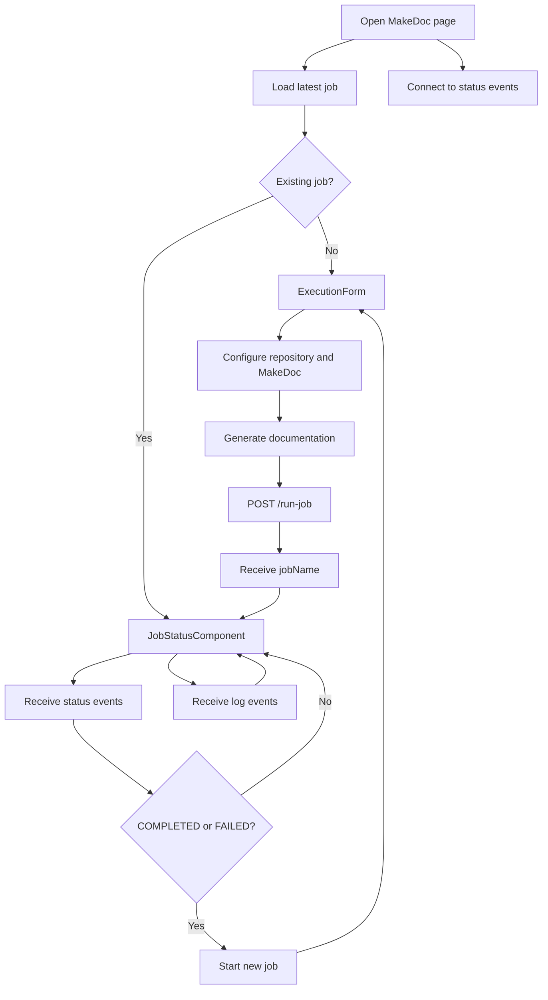

---

# Endpoint Overview

| Endpoint | Method | Used by | Purpose |
|---|---|---|---|
| `/api/makedoc/run-job` | POST | `ExecutionForm` | Starts a new MakeDoc execution |
| `/api/makedoc/latest-job` | GET | `MakeDocPage` | Retrieves the latest execution |
| `/api/makedoc/events` | GET | `MakeDocPage`, `JobStatusComponent` | Streams job status events |
| `/api/makedoc/job-logs/:jobName` | GET | `JobStatusComponent` | Streams stored and live logs |

---

# `POST /api/makedoc/run-job`

## Purpose

Starts a new MakeDoc Kubernetes Job.

## Request

The frontend sends:

```text
repoUrl
accessToken
inputDir
outputDir
workspace
profile
filter
selections
```

## Response

A successful request returns the created job name.

Conceptually:

```text
{
    jobName: "makedoc-job-a1b2c3d4e5f6"
}
```

The returned job name becomes the identifier used by the status and log components.

---

# `GET /api/makedoc/latest-job`

## Purpose

Returns the latest MakeDoc execution known by the backend.

This allows the frontend to restore the execution view after a refresh.

Possible response:

```text
{
    exists: true,
    jobName: "makedoc-job-a1b2c3d4e5f6",
    status: "MAKEDOC_RUNNING"
}
```

If no job exists:

```text
{
    exists: false
}
```

---

# `GET /api/makedoc/events`

## Purpose

Provides live MakeDoc status events using Server-Sent Events.

Example:

```text
data: {"jobName":"makedoc-job-a1b2c3d4e5f6","status":"STARTED"}

data: {"jobName":"makedoc-job-a1b2c3d4e5f6","status":"CLONING_REPOSITORY"}

data: {"jobName":"makedoc-job-a1b2c3d4e5f6","status":"MAKEDOC_RUNNING"}

data: {"jobName":"makedoc-job-a1b2c3d4e5f6","status":"COMMITTING_DOCUMENTATION"}

data: {"jobName":"makedoc-job-a1b2c3d4e5f6","status":"COMPLETED"}
```

The frontend filters these events by `jobName`.

---

# `GET /api/makedoc/job-logs/:jobName`

## Purpose

Provides the logs belonging to one MakeDoc execution.

The backend sends:

1. previously collected logs
2. newly generated logs

The connection remains open while new logs are available.

This allows the frontend to reconnect and reconstruct the log output.

---

# Authentication Flow

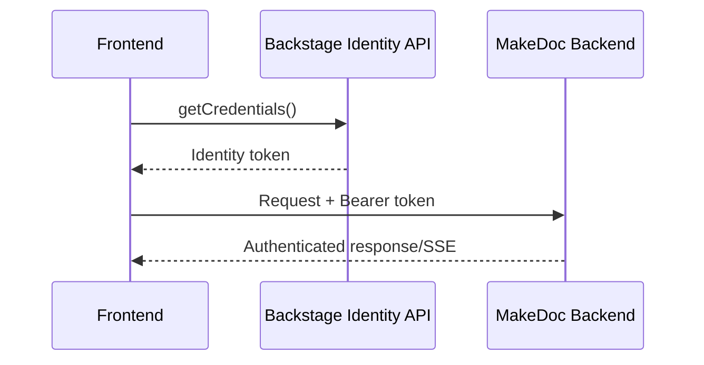

The identity token is obtained separately for each connection.

---
# Error Handling

## ExecutionForm

Errors from `/run-job` are displayed using the Backstage alert API.

---

# Important Design Decisions

## Backend-owned logs

The backend collects Kubernetes logs independently of the browser.

This means closing or refreshing the browser does not stop log collection.

## LocalStorage for form configuration

The form configuration is persisted locally so users do not have to repeatedly enter the same repository and MakeDoc settings.

The Git access token is excluded.

## SSE for live updates

Server-Sent Events provide a persistent one-way connection from backend to frontend.

They are used for both:

- job status
- job logs

## Job name as execution identifier

The generated Kubernetes job name is passed through the entire frontend lifecycle:

```text
run-job
   ↓
jobName
   ↓
MakeDocPage
   ↓
JobStatusComponent
   ↓
events + job logs
```
